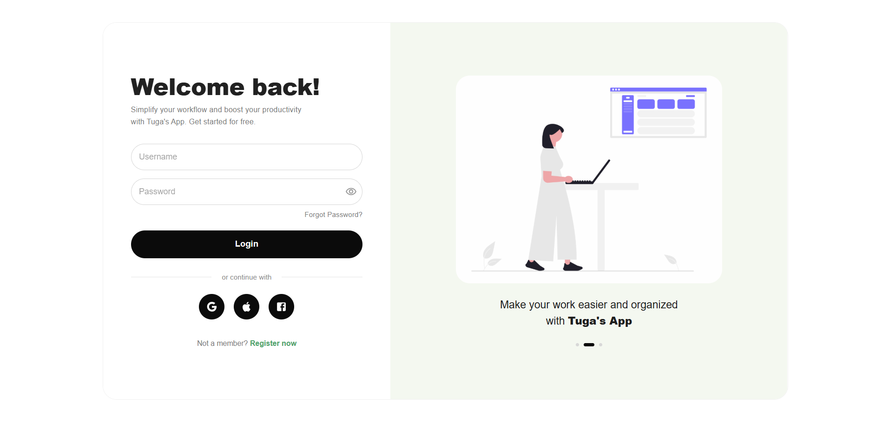

# React Login UI (MUI) + Firebase Google Sign-In

This project is a simple login UI built with React (Vite) and Material UI. It includes basic form validation and Google Sign-In via Firebase Authentication. After signing in with Google, the app redirects to a token page and displays the user token.

## What’s included

- Responsive login layout (two-column on desktop, stacked on mobile)
- Email + password form validation (no backend login)
- Google Sign-In using Firebase Authentication
- `/token` page that shows the stored token
- Firebase Hosting configuration for deployment

## Tech stack

- React + Vite + TypeScript
- Material UI (MUI)
- React Router
- Firebase Authentication + Firebase Hosting

## Screenshots

- Login page: `public/login.png`
- Token page: `public/token.png`

## Project structure (high level)

```text
src/
  app/router.tsx
  components/Auth/GoogleButton.tsx
  firebase/
    firebase.ts
    auth.ts
  pages/
    LoginPage.tsx
    TokenPage.tsx
```

## Run locally

```bash
npm install
npm run dev
```

The dev server runs on `http://localhost:5173`.

## Firebase setup (Google Sign-In)

1. Create a Firebase project in the Firebase Console.
2. Go to **Authentication → Sign-in method** and enable **Google**.
3. Add a **Web app** under **Project settings** and copy the config values.
4. Create a `.env` file in the project root:

```bash
VITE_FIREBASE_API_KEY=YOUR_API_KEY
VITE_FIREBASE_AUTH_DOMAIN=YOUR_AUTH_DOMAIN
VITE_FIREBASE_PROJECT_ID=YOUR_PROJECT_ID
VITE_FIREBASE_STORAGE_BUCKET=YOUR_STORAGE_BUCKET
VITE_FIREBASE_MESSAGING_SENDER_ID=YOUR_MESSAGING_SENDER_ID
VITE_FIREBASE_APP_ID=YOUR_APP_ID
```

Note: don’t commit `.env` to GitHub.

## Routes

- `/` → Login page
- `/token` → Token page (displays the token stored in `sessionStorage`)

## Deploy (Firebase Hosting)

```bash
npm run build
firebase deploy
```

## Live demo

- https://webpage-login-6a9d5.web.app

---

## 🖼️ Screenshots

- **Login Page:**  
  `public/login.png`
  

- **Token Page:**  
  `public/token.png`
  


